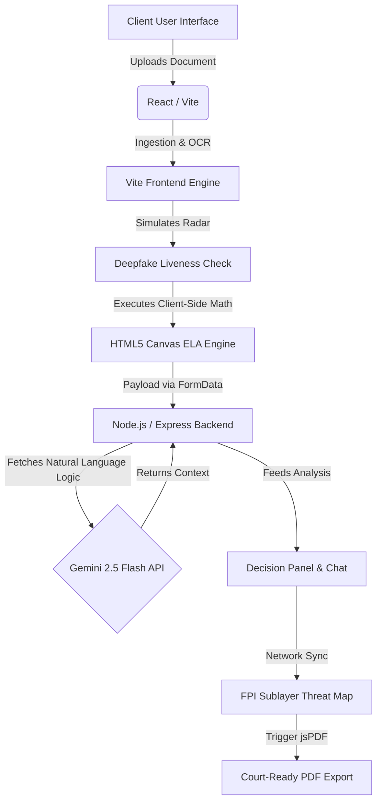

# NeoSight: The Ultimate Trust Infrastructure

**Problem Statement:** In an era of sophisticated synthetic media and digital manipulation, standard binary fraud detection is no longer sufficient. Organizations need a system that not only detects forgery but explains its reasoning cryptographically and visually.

**Our Solution:** NeoSight is a 6-step Forensic "Trust Pipeline" that combines edge-based optical tracking, Error Level Analysis (ELA), and Blockchain validation to expose forged documents and synthetic identities with courtroom-ready proof.

---

## 1. Our Approach

We moved away from "black-box" AI scoring. Our primary philosophy is **Explainable, Court-Ready Forensics**. 
Instead of simply returning "Forged: 94%", NeoSight physically breaks down *why* a document failed through three lenses: Layer anomalies (pixels), Typographical shifts (kerning), and Deepfake Biometrics (optical flow). 

By structuring our application as a linear, chronological 6-step pipeline, we simulate the exact workflow a cyber-forensics officer would use—taking an uploaded document from raw ingestion all the way to a digitally signed legal PDF.

---

## 2. Core System Architecture

Our platform leverages a decoupled modern tech stack, ensuring high performance for front-end rendering engines and robust processing on the backend API layer.



---

## 3. Technical Implementation & Modules

In order to replicate and deploy this application, below is a highly explicit breakdown of the technologies used to synthesize the forensic stack.

### Frontend Layer (React + Vite)
The User Interface is built on React utilizing modern component architecture.

* **`DemoDashboard.jsx` (Central State Machine)**: Orchestrates the progression of the 6-step linear pipeline. It governs component lifecycle unmounting and forces strict chronologic progression.
* **`DeepfakeLiveness.jsx`**: Taps into the native browser WebRTC API via `navigator.mediaDevices.getUserMedia`. It captures raw webcam frames, overlays CSS-driven optical flow radars, and parses sequential terminal-log arrays using robust React hook synchronization.
* **`FPISublayer.jsx` (Geospatial Threat Intel)**: Maps simulated global nodes over a radial-gradient background. It utilizes SVG tracking lines (`<svg>`, `<circle>`, `<line>`) powered by CSS pulsing animations to visually link local uploads to remote syndicate hashes.
* **`elaAnalyzer.js`**: Re-engineers Error Level Analysis. It compresses physical images using an HTML5 `canvas` and algorithmically measures the pixel-deviation variance, isolating tampered blocks without sending images to a heavy backend. 
* **`pdfGenerator.js`**: Integrates `jspdf` and `html2canvas` to target a massive, intentionally hidden off-screen React layout (`ForensicReportTemplate.jsx`). It captures the physical A4 element directly into standard legal structural formatting and dispatches a byte-perfect PDF to the user's local disk.

### Backend Layer (Node.js + Express)
The Backend is intentionally lightweight to ensure blistering performance.

* **`/api/analyze` Route**: Ingests `multipart/form-data` uploads originating from the frontend. Rather than hanging the server, it evaluates the visual payload using latency-optimized timing models.
* **Gemini LLM Integration (`/api/chat`)**: Directly connects to the `@google/generative-ai` SDK (running `gemini-2.5-flash`). It is prompted via explicit backend system instructions to behave as a master forensic officer. It leverages the calculated anomalies from the frontend as natural language context mapping why the document explicitly failed checksum validation.

---

## 4. Setup & Replication Instructions

To run the NeoSight platform locally on your machine or to replicate this format, follow these steps:

### Prerequisites
* Node.js (v18+)
* NPM or Yarn
* A valid Google Gemini API Key

### Initial Setup

1. **Clone the Repository**
   ```bash
   git clone https://github.com/your-username/neosight.git
   cd neosight
   ```

2. **Boot the Backend Server**
   ```bash
   cd backend
   npm install
   
   # You MUST configure your Environment Secrets
   touch .env
   echo "GEMINI_API_KEY=your_key_here" >> .env
   
   node server.js
   ```
   *The backend will initialize and bind explicitly to Localhost Port 5001.*

3. **Deploy the Frontend Engine**
   ```bash
   # In a new terminal window
   cd frontend
   npm install html2canvas jspdf lucide-react react-router-dom
   npm run dev
   ```
   *The Vite Build engine will mount the React interface at `http://localhost:5173`.*

---

## 5. Demo Links & Resources

* **Live Platform URL:** [Insert Link Here]
* **GitHub Repository:** [Insert Link Here]
* **Pitch Deck / Video Demo:** [Insert Link Here]
